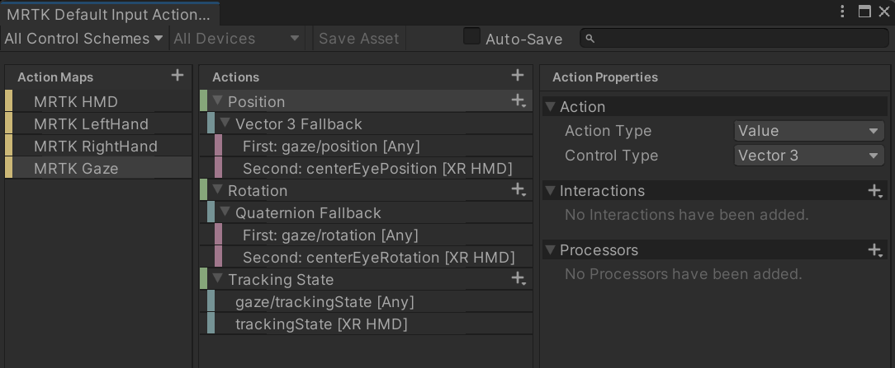

# Eye tracking &#8212; MRTK3

## Overview

Eye tracking is handled natively by the Unity Input System, however MRTK3 provides useful helpers to make adding eye tracking easy.

By default the `MRTK XR Rig` prefab already has MRTK3's gaze controller. If you're not using `MRTK XR Rig` and want to use MRTK3's gaze controller, add the `MRTK Gaze Controller` prefab to your Unity scene.

MRTK's gaze controller prefab has an Unity XR Controller and Interactor that binds to Unity's eye and head gaze input. The controller's actions are setup so that eye gaze is favored over head gaze. If eye gaze is disabled, not configured, or not calibrated, the controller will use the head gaze pose instead. For more details on how MRTK3's gaze controller's action bindings have been configured, see the included *MRTK Default Input Actions* Unity asset.

> [!IMPORTANT]
> If you want to enable eye tracking when using OpenXR, the **Eye Gaze Interaction Profile** must be added to OpenXR's interaction profile configuration. See [Set up a new OpenXR project with MRTK](/windows/mixed-reality/develop/unity/new-openxr-project-with-mrtk.md)   for more about configuring OpenXR settings in Unity.
>
> Also, if you are using the **Universal Windows Platform**, be sure to add the *GazeInput* capability at *Project > Project Settings > Publishing Settings > Capabilities*.

## Fuzzy Gaze Interactor

MRTK3's gaze controller has been setup to use the `FuzzyGazeInteractor`, a Unity interactor that implements a fuzzy gaze interaction technique where objects within a certain cone angle and distance range are targeted and interacted with based on the user's gaze direction. The scoring system helps prioritize potential targets based on their suitability for interaction.

The script defines several fields and properties that control the behavior of the gaze interactor. Some of the important fields include:

- **coneAngle**: The angle within which objects will be considered for targeting by gaze.
- **minGazeDistance** and **maxGazeDistance**: The minimum and maximum distances at which objects can be targeted by gaze.
distanceWeight, angleWeight, distanceToCenterWeight, and angleToCenterWeight: Weights assigned to different criteria used to determine the "gaze score" of an object.
- **precision**: A value used to adjust the precision of the fuzzy gaze physics raycasts.
- **performAdditionalRaycast**: A flag indicating whether an additional raycast following the eye gaze is performed to improve scoring results.
- **precisionCurve**: An animation curve used to control the precision level based on the distance to the target.
  
The script overrides some methods from the base class `XRRayInteractor` to provide its own implementation. Notable overridden methods include:

- **IsHitValid**: Determines if a hit on an interactable object is considered valid based on the angle and distance criteria defined by the coneAngle, minGazeDistance, and maxGazeDistance fields.
- **ScoreHit**: Scores an interactable and its associated raycast hit based on distance, raycast hit angle, and target center angle. The score is a combination of weighted factors.
- **ConecastScoreCompare**: Compares raycast hits by their scores in ascending order.
- **GetValidTargets**: Retrieves the valid targets for the gaze interactor based on raycast hits and their scores.
  
## Interactor Dwell Manager

MRTK3's gaze controller is also setup with an `InteractorDwellManager` script component. This script implements dwell-based selection on interactable objects using the XR Interaction Toolkit in Unity. It manages the dwell timers, triggers the selection, and tracks the dwell state of interactables for the specified interactor. To utilize gaze dwell-selection, the targeted interactable must be MRTK3's `StatefulInteractable` and have the `Use Gaze Dwell` flag set.

> [!NOTE]
> Dwell based selection is not recommended where hand or voice input is possible, as dwell may lead to unpredictable or unintended UI element activations. Applications may still want to consider dwell input for accessibility or in scenarios where voice and hand input are not available. For design guidance on how to best use dwell see [Eye-gaze and dwell](/windows/mixed-reality/design/gaze-and-dwell-eyes.md#challenges-of-the-eye-gaze-and-dwell-interaction-model) and [Head-gaze and dwell](/windows/mixed-reality/design/gaze-and-dwell-head.md#design-principles).

After entering hover state, this interactor will keep selecting before dwell trigger time passes, after which the selection is triggered on the interactable. The dwell settings can be configured using the following:

- **DwellTriggerTime**: Determines how long the interactor remains selecting an interactable after entering the hovered state.