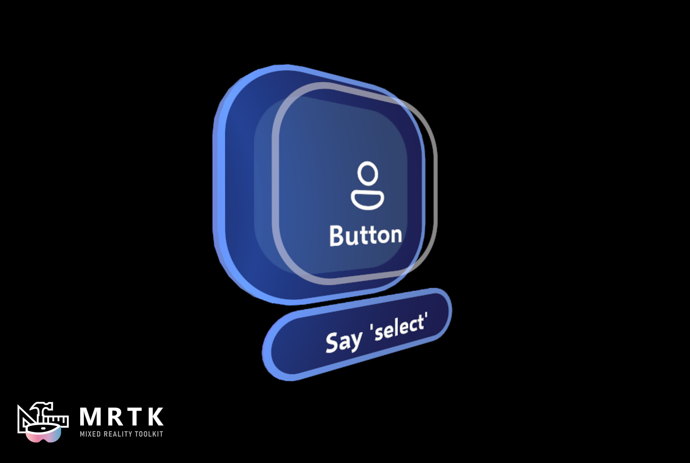

# See-it, Say-it Label

You can use See-it, Say-it labels to communicate the voice command keyword for a button to the user. For the keyword to work, you have to set up [speech input](/windows/mixed-reality/mrtk-unity/mrtk3-input/packages/input/speech). The implementation of See-it, Say-it labels has changed from MRTK2 to MRTK3. Mainly, in MRTK3 there are separate `SeeItSayItLabel-Canvas` and `SeeItSayItLabel-NonCanvas` prefabs, and a component, `See It Say It Label`, which is used to enable the labels. 

 

### Enabling See-it, Say-it Labels

In the canvas and non-canvas button prefabs, these labels are disabled by default. When the scene is created, the See It Say It Label component is responsible for enabling the label if the [input](/windows/mixed-reality/mrtk-unity/mrtk3-input/packages/input/overview) and [speech](/windows/mixed-reality/mrtk-unity/mrtk3-windowsspeech/packages/windowsspeech/overview) packages are installed in the project. The purpose of this check is to prevent labels from appearing when voice commands aren't functional.

 

### Label Text 

The See It Say It Label component also sets the text of the label to reflect the button's speech recognition keyword. This keyword can be modified through the `SpeechRecognitionKeyword` property under `Advanced StatefulInteractable Settings` in the `Pressable Button` component. 

 

### Position
You may also choose to reposition the label relative to a chosen transform by setting `PositionControl` on the See It Say It Label component. If you are repositioning a canvas label, PositionControl should be a RectTransform. 

 

### Animation Effect
If the labels are enabled, they appear when a button is actively hovered. This is accomplished using a `State Visualizer`, which plays an animation effect when the button Interactable is actively hovered.